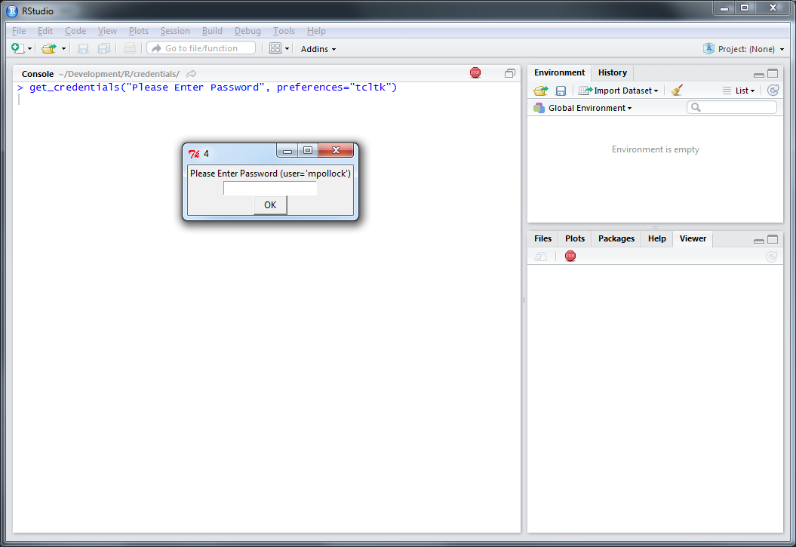
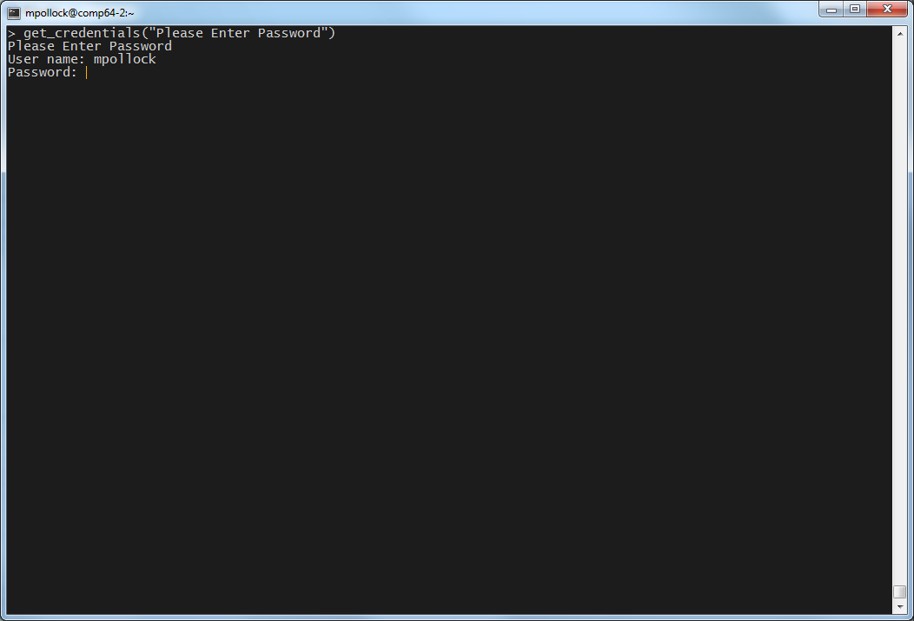

A package to simplify gathering credentials from a user.

## Installation

```{r, eval=FALSE}       
# install.packages("devtools")
devtools::install_github("mitre/credentials")
```

## Use

Asking for user credentials in `R` is tricky because `R` can be run in many different ways. There are interactive and non-interactive `R` sessions. `R` can be run in text mode on a terminal, with RStudio, or using the R GUI. The displays available vary as do the system libraries `R` may or may not be compiled with. The packages that any given `R` user has installed are likely to differ. With any given set of the above options each credentialing system may or may not work. No credentialing option that prevents a plain-text password from being passed to a function or typed into the console works in every `R` environment. 

The `credentials` package approaches this problem by accepting that no one-size-fits all solution exists, so the next best thing is the figure out which solution will work in any given situation.
This package provides a layer of abstraction between package authors needing to collect credentials and user who have different preferences about how to use R.
The package will interrogate the users R session to determine the best approach for collecting credentials, do the collection, and return the result to the caller in a consistent list structure.

## Credentialing Options

There are currnetly four credentialing options:  

### Shiny + miniUI

`get_credentials_via_shiny()` uses a shiny app to ask for credentials. This is the default whenever `R` is being run from RStudio. It is also available for from R GUI though it is not the default because it opens the app in a browser in that case.

```{r, out.width=650, echo=FALSE}
knitr::include_graphics("./screen_caps/rstudio_shiny.png")
```

### rstudioapi

Another approach is to use the `rstudioapi` package with `get_credentials_via_rstudioapi()`. This option is only available if `R` is running from RStudio and is never the default recommended approach unless the `CRAN` packages (`shiny` and `miniUI`) necessary for the `shiny`-based approach are not installed. It is a little bit faster than the `shiny` approach, but since we are talking about humans typing inpu there the speed difference is negligable. 

```{r, out.width=650, echo=FALSE}
knitr::include_graphics("./screen_caps/rstudio_rstudioapi.png")
```

### tcltk

The third option is using `tcltk`. This requires that `R` was compiled with `tcltk` and that the `tcltk` package is installed. It is also necessary to be running R with an available display. One tricky corner-case here is with RStudio Server, which does not work well with `tcltk`.

With RStudio (desktop) it looks like:
```{r, out.width=650, echo=FALSE}

```

When running with R GUI you will get something like:
With RStudio (desktop) it looks like:
```{r, out.width=650, echo=FALSE}
knitr::include_graphics("./screen_caps/rgui_tcltk.png")
```

### readline

Finally, `readline` is a perfectly good option so long as one can suppress the echoing of text typed on the console. For this reason it is generally reserved as a good option for `R` run on the command line

```{r, out.width=650, echo=FALSE}

```


## Package Dependencies

The `credentials` package does not declare any dependencies on purpose. This avoids situations where, for example, people who always use `R` on the command line would be compelled to install the `shiny` package when a `readline`-based solution with echoing turned off would be sufficient. Furthermore, the package is really intended to be used by other packages, not directly from the console. As such it is reasonable to punt to the parent package to declare whatever dependencies the package authors desire. Thus, for example, if `tcltk` is the preference of a given package author, he or she may declare a `tcltk` dependency and specify that as a preferred method when calling `get_credentials()` to ensure that `tcltk` will be used whenever possible.